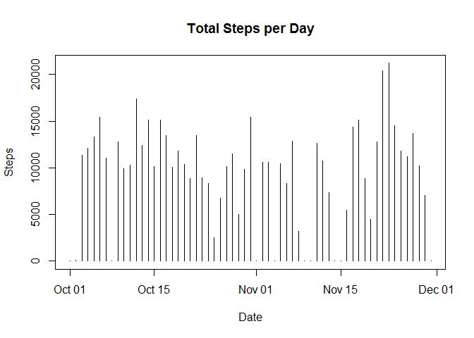
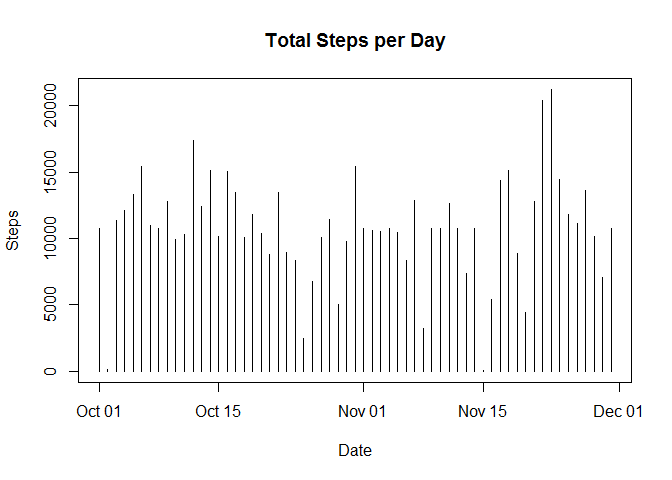

# Reproducible Research: Peer Assessment 1
<<setup, echo=FALSE, cache=FALSE>>=
## numbers >= 10^5 will be denoted in scientific notation,
## and rounded to 2 digits
options(scipen = 1, digits = 2)
@

## Loading and preprocessing the data

**Load the data**

```r
data <- read.csv('activity.csv')
```

**Process/transform the data**

```r
data$date <- as.Date(data$date, '%Y-%m-%d')
```


## What is mean total number of steps taken per day?

**Calculate the total number of step taken per day**

```r
stepsByDay <- aggregate(data$steps, by=list(data$date), FUN=sum, na.rm=TRUE)
```

**Make a histogram of the total number of steps taken each day**

```r
plot(stepsByDay, type='h', main='Total Steps per Day', ylab='Steps', xlab='Date')
```

 

**Calculate and report the mean and median of total number of steps taken per day**

```r
theMean <- mean(stepsByDay$x)
theMedian <- median(stepsByDay$x)
theMean
```

```
## [1] 9354.23
```

```r
theMedian
```

```
## [1] 10395
```


## What is the average daily activity pattern?

**Average number of steps taken across all days**

```r
stepsAvg <- aggregate(data$steps, by=list(data$interval), FUN=mean, na.rm=TRUE)
plot(stepsAvg, type='l', main='Average Steps in Day', ylab='Steps (avg)', xlab='5-minute interval')
```

 

**Which 5-minute interval contains the maximum number of steps?**

```r
stepsAvg[which.max(stepsAvg$x),1]
```

```
## [1] 835
```


## Imputing missing values

**Total number of missing values**

```r
nrow(data[is.na(data$steps),])
```

```
## [1] 2304
```

**Strategy for filling in all of the missing values**

Replaces NAs with the 5-minute average, we need to repeat the 5-minute average by the number of days in data set

```r
nDays = length(unique(data$date))
means = rep(stepsAvg$x, nDays)
NAs = is.na(data$steps)
```

**Create a new dataset with the missing data filled in**

```r
data.noNA <- data
data.noNA[NAs,]$steps <- means[NAs]
```

**Histogram of the total number of steps, mean and median total number of steps taken per day**

```r
stepsByDay.noNA <- aggregate(data.noNA$steps, by=list(data.noNA$date), FUN=sum)
plot(stepsByDay.noNA, type='h', main='Total Steps per Day', ylab='Steps', xlab='Date')
```

 

```r
theMean.noNA <- mean(stepsByDay.noNA$x)
theMedian.noNA <- median(stepsByDay.noNA$x)
theMean.noNA
```

```
## [1] 10766.19
```

```r
theMedian.noNA
```

```
## [1] 10766.19
```

The results with missing values filled differ from previous estimates.

- The new mean is 115% higher than the previous.
- Also the new median is 103% higher than the previous.


## Are there differences in activity patterns between weekdays and weekends?
